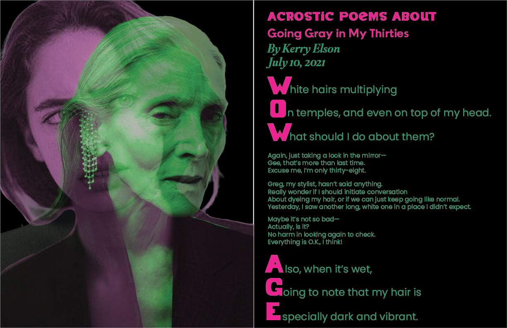

# Milestone 1

Group Members:
Nancy Yoder
Jordan Evans
Raiyah Shah

Our project is a digital magazine using different elements we create on our own and borrow from the new york times. The magazine will include at least 3 spreads (2 “pages”) with different magazine components such as cartoons, poetry, stories, horoscopes, word games etc. All of the magazine content will be interactive, enhancing the magazine experience in a web format. 

We want to create this magazine because it will show case our graphic design/layout design skills for our portfolios, and making the project seamlessly interactive will also be a good coding challenge. The inspiration for our magazine are these cool magazine spreads we found on pintrest. The combination of photography, typography, and color is very inspiring. 

[Pintrest Board](https://www.pinterest.com/jordanaevanz/fwd-project-3/)

The intended audience for our magazine is creative minds, specifically people interested in  graphic and layout design.

Nancy - My personal contribution will be a spread (2 pages) in the magazine. I will also collaborate on the overall style of the magazine as well as making my portion and the rest of it interactive. 

Jordan - My personal contribution will also be a 2 page spread in the magazine (probably about beauty, but definitely focusing on a specific topic like that). It will showcase interactive features throughout the article using react.I would also (if time allots) add in a small game.

Raiyah - My personal contribution will be a two page spread as well in the magazine with an article about horoscopes and a simple, interactive game for users. We will all contribute to the overall aesthetic of the magazine and the varying design components.

Goals: 
- Prototyping/proof of concept
    - Interactivity with type using react
    - Interactivity with image using react
    - Recreation of cover
    - Design kit
    - Flip the pages mechanism
- MVP
    - Interactive cover
    - Interactive cartoon
    - Interactive typography spread
    - Interactive story
    - Works well
- Stretch goals
    - Interactive game/experience (horoscope?)
    - More interactivity
    - Flip animation or scroll/appear animation

# Milestone 2

To get this project started I made a framework for the app by making "pages" objects which house all of the content for each unique page. I was then able to recreate the mockup I made for milestone 1 putting the image on page 1 and the text on page 2. I stuggled to figure out how to use adobe fonts on this site, but after watching tutorials I was able to do this quite easily. I haven't yet tested the interactivity I was planning on, but I will start working on that today. I am realizing that react is not as straightforward as I orginally thought and therefore I think this project will be less beautiful than I originally envisioned. But I will just try to work with what I can and still make something cool!

# Milestone 3

Here is a link to the final website:
[Digital Magazine](https://nancyyoder.github.io/Cover)

# Milestone 4

Overall, this project was very daunting, but turned out to be easier than I thought it would be when it was all said and done. Being a newbie to React, I was able to understand the file structure and layout, but working with state proved to be more difficult than I expected. I ended up not including as much interactivity as I originally planned. Most of the time spent on this project was setting up the site, compiling all of our work together, and deploying the website. 

In regards to the original goals we set, we were able to achieve interactivity with image and type in react, as well as an interactive poem, horoscope reading, and game. We changed page navigation from scrolling to a navigation bar, so goals relating to scrolling are no longer relevant. We made this decision after making the initial spreads because we thought it made more sense for the overall hierarchy of our site. 

We ended up achieving a good amount of interactivity between the three different spreads. I would've liked a little more fluid interactivity, rather than straightforward button presses, but given the time we had I think we achieved a solid site. 

I am very happy that I now can say I have experience with React. Even though I am not an expert, having my foot in the door with React is still a marketable skill. Overall, I had a good experience with the project and my group and I am proud of what we came up with. 

